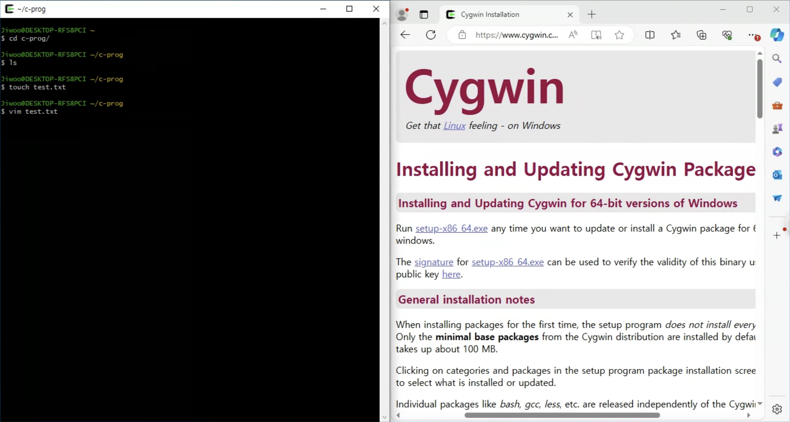
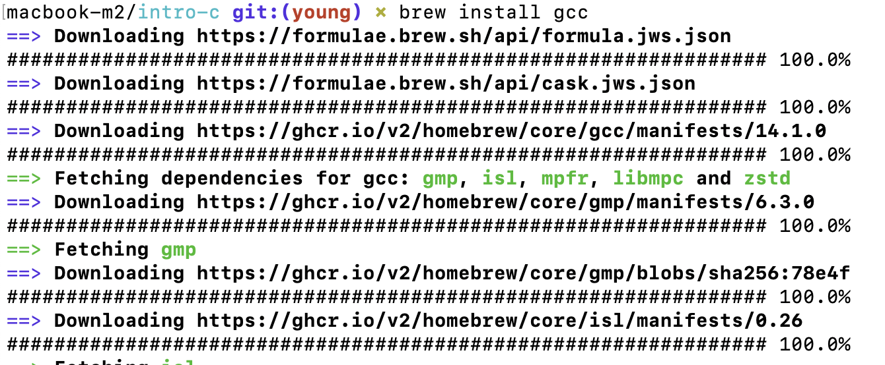
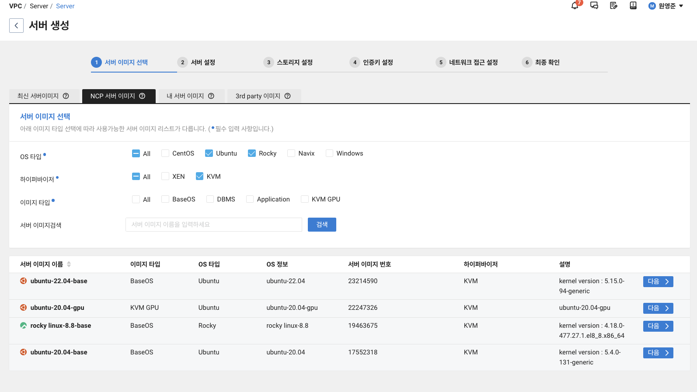
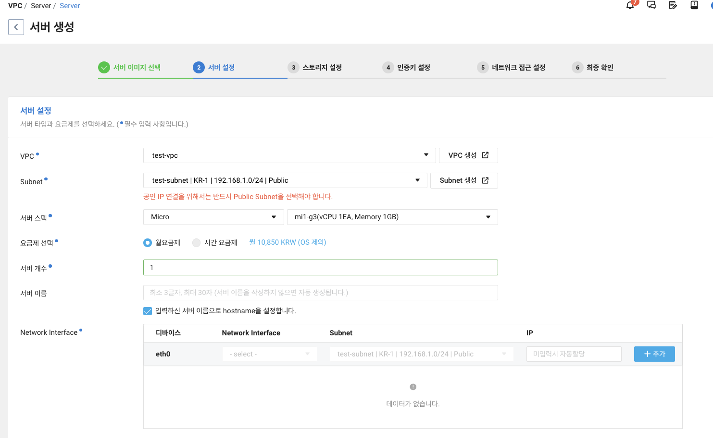

### Environment setup 

#### a-1. windows (using Cygwin)

download and install https://www.cygwin.com 

- choose your mirror site
- need gcc, g++: Select View: Category, Package: All, Select Devel.
- need vim, Package: All, Search vim

​	[screenshot of windows]



#### a-2. windows (using WSL, recommended)

  + open powershell from start menu
    
    ```
    $ wsl --install
    ```
    
  + restart windows

  + open powershell 
    
    ```
    $ubuntu config --default-user root
    ```
    
  + start menu -> select 'ubuntu'
    
    ```
    $apt update
    $apt install build-essentials
    ```

#### b.mac

1. open terminal (Utilities -> Terminal)
2. install homebrew https://brew.sh/

```
$ /bin/bash -c "$(curl -fsSL https://raw.githubusercontent.com/Homebrew/install/HEAD/install.sh)"
```

3. install gcc and others (e.g., brew install)

```
$ brew install gcc
$ brew install macvim
$ gcc-13 --version
```

​	[screenshot of homebrew]



4. let's not use pre-installed gcc in mac os, depedning on your gcc version. It could be the following:

```
$ g++-14 --version
```

#### c. linux (ubuntu)

1. open terminal
2. install gcc and others

```
$ sudo apt update
$ sudo apt install build-essential
$ g++ --version
```

#### d. alternatives? use cloud and its linux instance

Check out the following clouds for free credits:

- https://www.ncloud.com/   vpc only for new users (free g3 instance)
- https://aws.amazon.com/
- or gcp or whatever you like
- let's take a look at ncloud together.


​	[screenshot of ncloud configurations]





#### e. You may want to check out ssh, tmux, and etc.

##### tmux for your linux cloud:

```
$ sudo apt install tmux
```

##### tmux for your mac:

```
$ brew install tmux
```

##### edit tmux configuration file:

```
tee -a ~/.tmux.conf <<EOF

setw -g mode-keys vi
set -g prefix C-a                                                                                                                 
unbind-key C-b
bind-key C-a send-prefix
EOF
```
